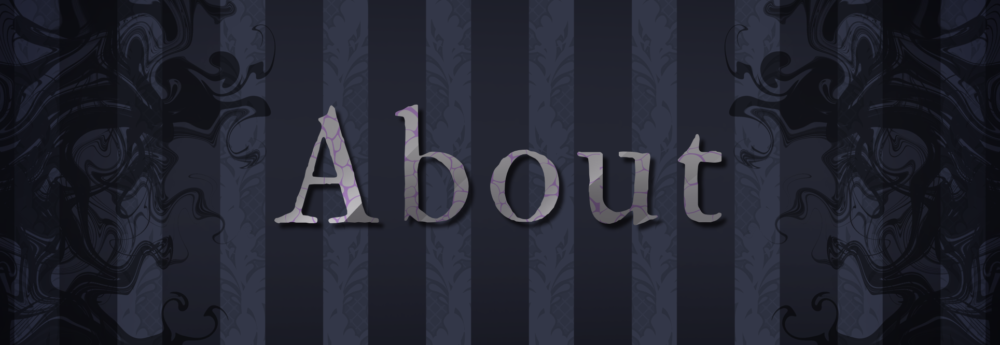

# Zeo Neyo

probably insert twitch bio ngl 
> NIGHTMARE NIGHTMARE NIGHTMARE

---

🤍 Who is Zeo Neyo? 🖤
* Demi-God : something something.
* Lore stuff : yip yap yip yap
* Heathen's mentioned : lore lore

---

